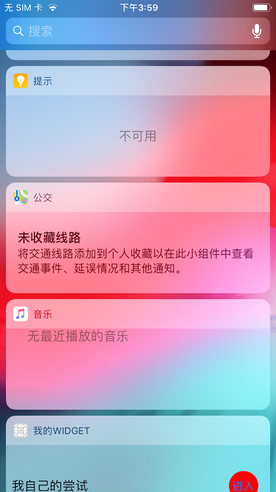
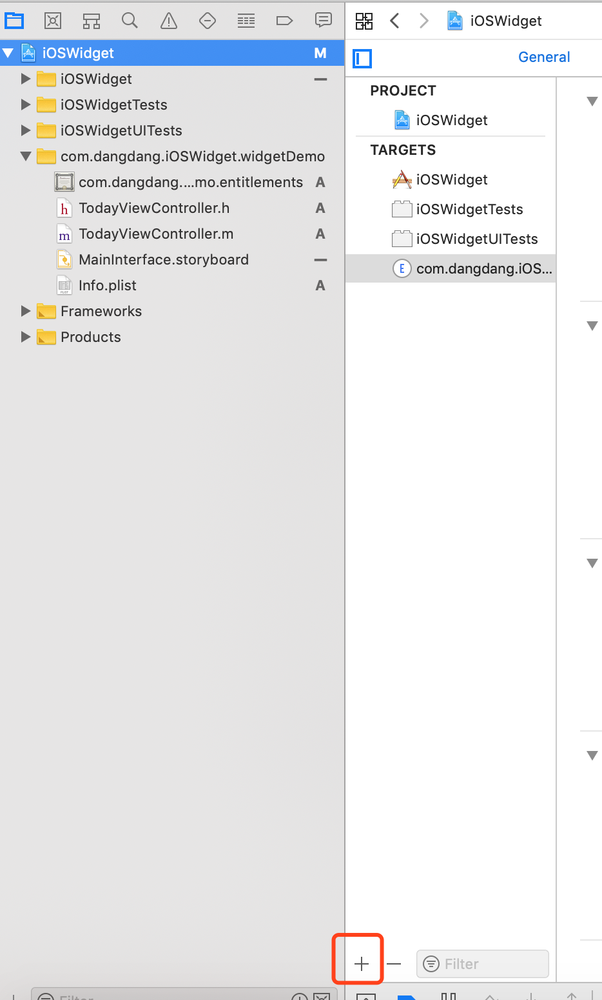
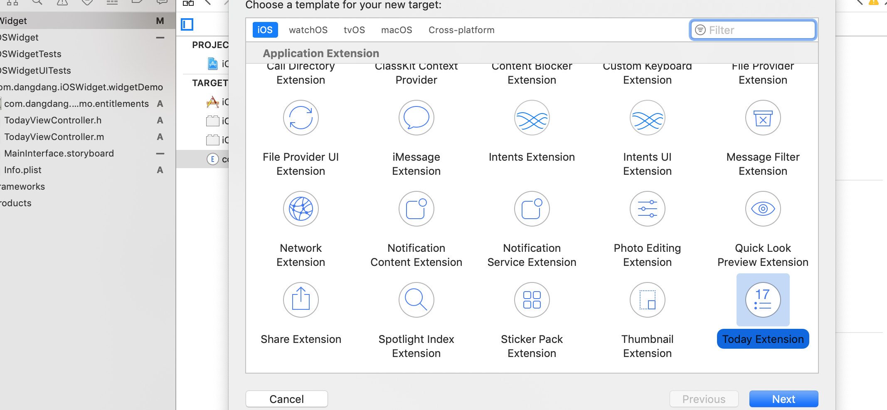
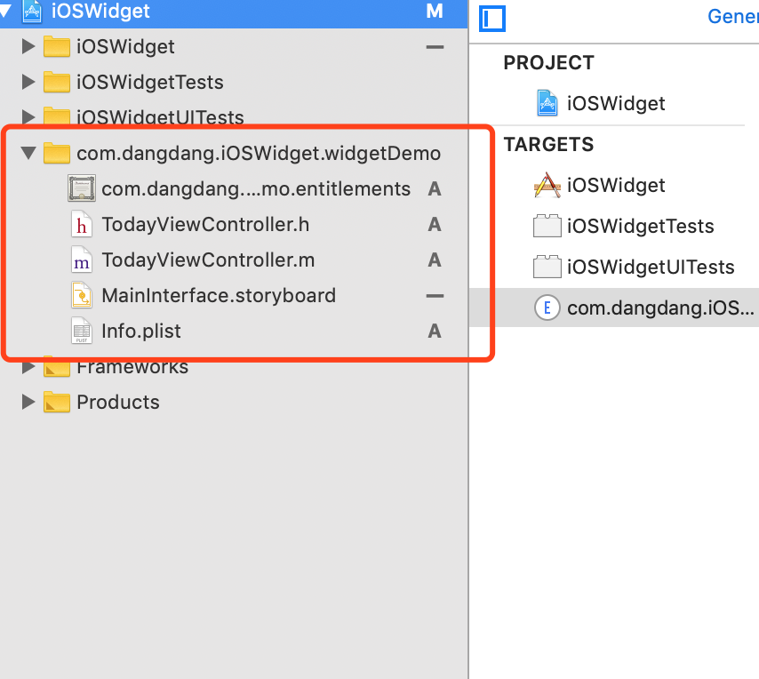

### This is iOS widget devepment

> 添加类似如下图苹果widget小组件开发

* 其实步骤非常简单，但是觉得这个功能应该记录一下。

1. 创建一个扩展target

2. 选择 Today Extension

3. 目录会变成下图所示，如果选择storyboard 编程，那么就可直接在MainInterface.storyboard 中画图

4. 如果纯代码编码，则改变直接修所在target的mainInterface就行，或者修改info.plist的NSExtension选项

5. 相关的开发没有什么区别，如果跳转到主应用，需要scheme 跳转。相关操作就不累赘了。

** 注意点：
    Extension target 需要打开app group 功能，如果，采用的是自动管理证书，那么我们只需要在xcode  Capabilities 打开App Group 功能；如果手动管理，我们需要自己在苹果开发者后台弄一套证书， 证书打开App group 即可。
